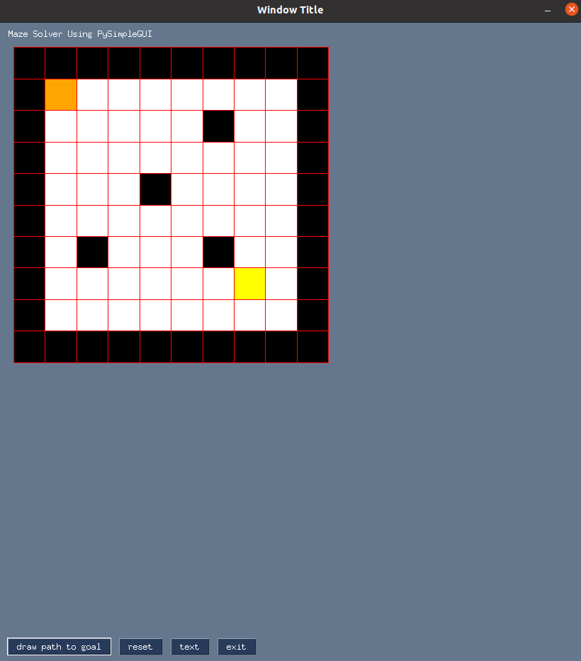
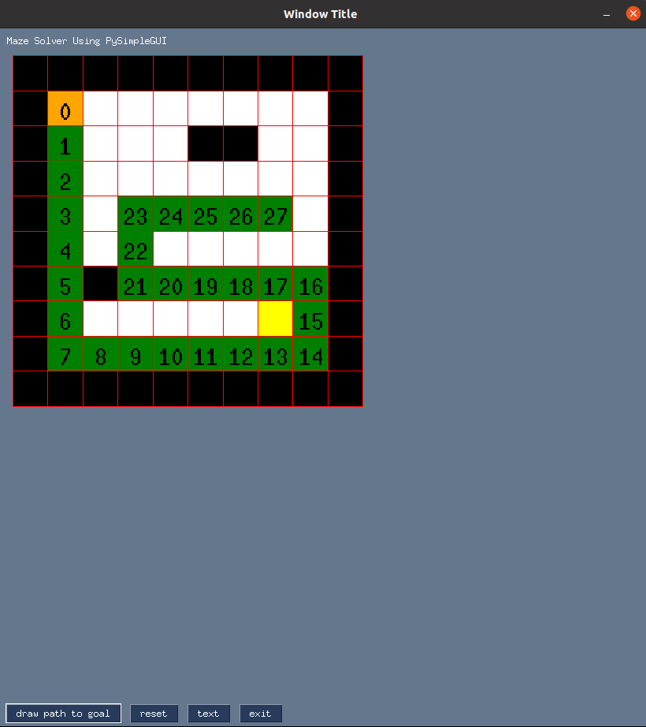
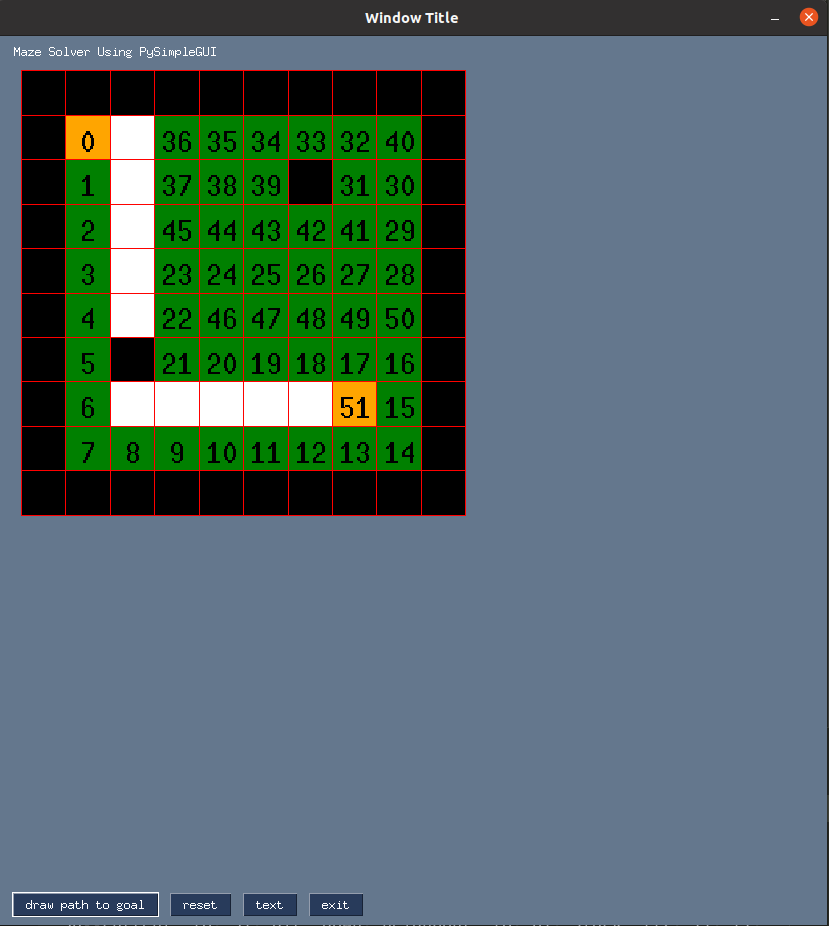

# algoGUI
Simple GUI App which visualizes the pathfinding process of various algorithms including Depth-First search, Breadth-First search, A* and others

## Example Usage
#### Example start

#### Example in progress pathfinding using DFS

#### Example goal found

